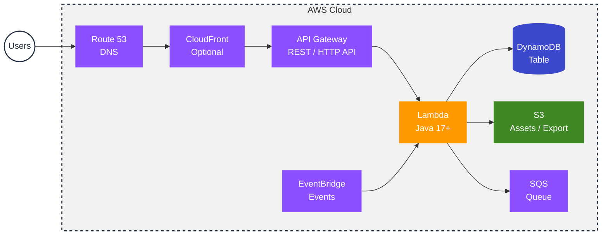
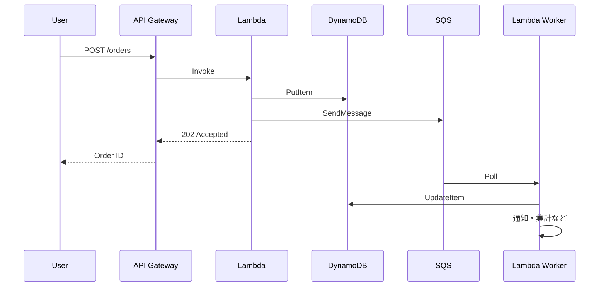

# AWS Architecture Diagram（サーバーレス・Java Lambda）

API Gateway + Lambda（Java）+ DynamoDB のサーバーレス構成例。既存の [aws-architecture.md](./aws-architecture.md) は ALB + EC2/Fargate + RDS のクラシック構成です。

---

## 構成の特徴

| 項目 | 説明 |
|------|------|
| **API Gateway** | 認証・スロットリング・キャッシュ。Lambda を HTTP で公開。 |
| **Lambda (Java)** | ビジネスロジック。Corretto 17 等。Cold Start を考慮した設計。 |
| **DynamoDB** | サーバーレス向け NoSQL。オートスケール・従量課金。 |
| **SQS / EventBridge** | 非同期処理・イベント駆動。Lambda のキック元。 |

---

## 非同期フロー（オプション）

---

## 既存図との使い分け

| 構成図 | ファイル | 向いているケース |
|--------|----------|------------------|
| クラシック 3 層 | [aws-architecture.md](./aws-architecture.md) | 常時稼働・セッション・RDS/ElastiCache 利用 |
| サーバーレス | 本ファイル | スパイク対応・従量・API 中心・イベント駆動 |
