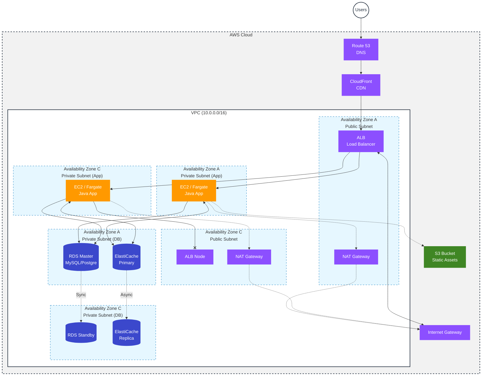
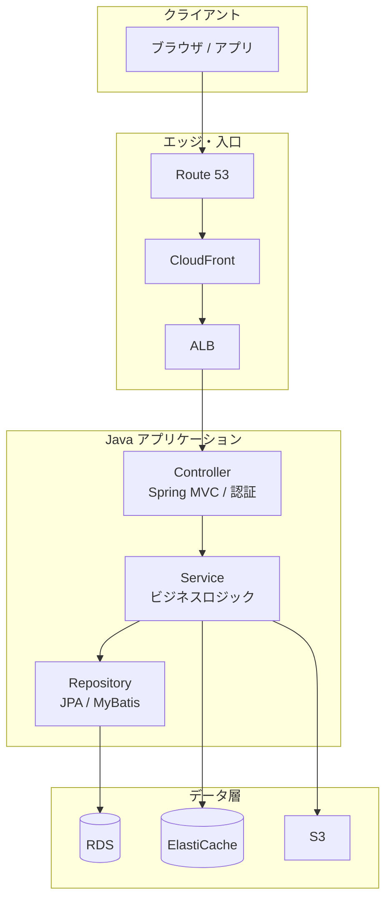
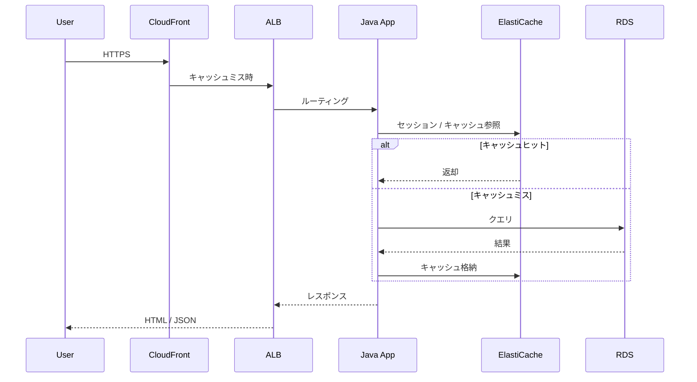
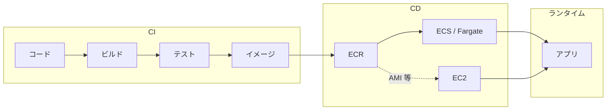

# AWS アーキテクチャ・設計

本ドキュメントは、Java アプリを ALB + EC2/Fargate + RDS で運用するクラシック構成の「AWS 構成図」に加え、コンポーネント設計・リクエストフロー・セキュリティ設計・デプロイ観点をまとめます。

---

## 1. AWS 構成図（インフラ）

---

## 2. コンポーネント構成（レイヤー）

アプリケーション側の責務をレイヤーで整理した構成です。

| レイヤー | 役割 |
|----------|------|
| エッジ・入口 | DNS・キャッシュ・負荷分散・TLS 終端 |
| Controller | HTTP リクエスト受付・入力検証・認可・レスポンス整形 |
| Service | トランザクション境界・キャッシュ利用・他サービス連携 |
| Repository | RDS への永続化・キャッシュ（Redis）の読み書き |
| データ層 | RDS（主データ）、ElastiCache（セッション/キャッシュ）、S3（静的・バッチ出力） |

---

## 3. リクエストフロー（シーケンス）

ユーザーリクエストが ALB → Java アプリ → RDS/Redis に至る流れです。

---

## 4. セキュリティ・ネットワーク設計

| 観点 | 設計方針 |
|------|----------|
| **入口** | WAF（必要に応じて）、ALB で TLS 終端、CloudFront で DDoS 軽減 |
| **ネットワーク** | アプリ・DB はプライベートサブネット、DB は 0.0.0.0 開放しない |
| **アウトバウンド** | NAT Gateway 経由で固定。必要なら VPC Endpoint で S3/DynamoDB 等を私的に利用 |
| **認証・認可** | アプリ内でセッション管理 or Cognito 等。IAM は EC2/Fargate のロールで最小権限 |
| **秘密情報** | Secrets Manager / Parameter Store で取得。コード・環境変数に平文で持たない |
| **ログ・監査** | ALB アクセスログ、CloudTrail、VPC フローログを有効化 |

---

## 5. デプロイ・運用の考え方

| 項目 | 方針例 |
|------|--------|
| **ビルド** | Maven/Gradle で JAR 作成、Docker イメージ化して ECR へプッシュ |
| **デプロイ** | ECS なら Rolling / Blue-Green。EC2 なら AMI 更新 + オートスケールグループ |
| **設定** | 環境ごとに Parameter Store / Secrets Manager を参照。イメージは共通化 |
| **監視** | CloudWatch（メトリクス・ログ）、アラーム、ヘルスチェック（ALB ターゲット） |

---

## 6. 関連ドキュメント

- サーバーレス構成（Lambda + API Gateway + DynamoDB）: [aws-architecture-serverless.md](./aws-architecture-serverless.md)